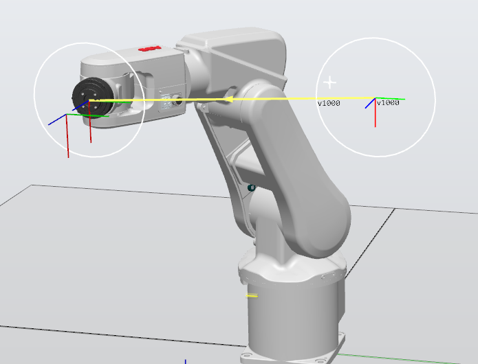
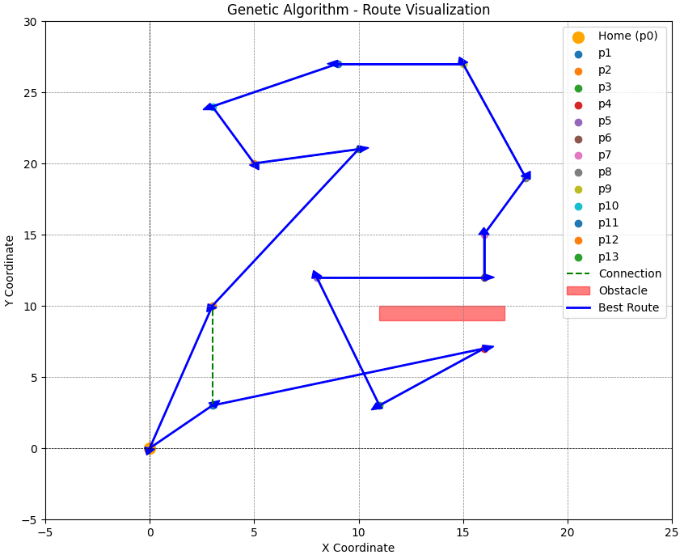
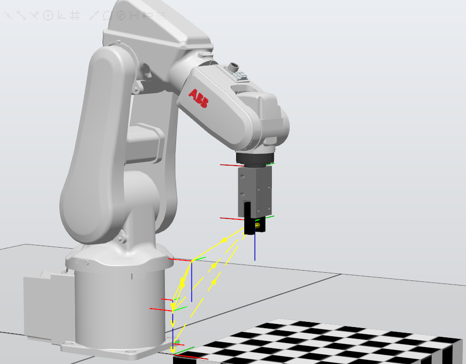

# Scripts for Advanced Methods of Programming Industrial Robots and Task Planning

## Table of Contents

| Description                                                                                                                                                      | Picture                                                                                        |
|------------------------------------------------------------------------------------------------------------------------------------------------------------------|------------------------------------------------------------------------------------------------|
| [Plots for movement close to singularity](close_to_singularity_graphs.py) (from a simulated ABB IRB 120)                                                         |  |
| [Algorithm for Travelling Salesman Problem](travelling_salesman_problem_for_a_robot.py) (mainly prepared by [@dariak153](https://github.com/dariak153))          |                |
| [Movement Control with Socket Communication](abb_socket_communication.py) (with a simulated ABB IRB 120) and [code in Rapid](abb_socket_communication_rapid.txt) |       |